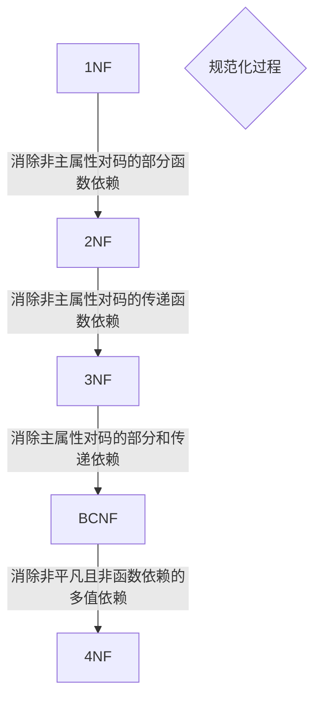

数据库系统概论
==
------------
第一章 绪论  
--  
#### 1.数据库是什么？      
    数据库是长期储存在计算机内、有组织的、可共享的大量数据的集合。  
#### 2.数据库管理系统是什么？
    数据库管理系统是位于用户应用与操作系统之间的一层数据管理软件；是基础软件。
#### 3.数据库与数据库管理系统的区别和联系？
    区别：数据库指的是一些数据的集合。数据库管理系统是位于操作系统和数据库应用系统之间的数据库管理软件。
    联系：数据库管理系统的存在使得数据库内的数据便于使用和维护。
#### 4.数据库管理系统的主要功能？    
    (1)数据定义功能
    (2)数据组织存储和管理
    (3)数据操纵
    (4)数据库的事务管理和运行管理
    (5)数据库的建立和维护。  
#### 5.数据库系统是什么？  
    数据库系统是由数据库、数据管理系统、应用程序和数据库管理员组成的存储、管理、处理、和维护数据的系统。
#### 6.数据库系统的特点？
    (1)数据结构化
    (2)数据共享性高、冗余度低、易扩充
    (3)数据独立性高
    (4)数据由DBMS统一管理和控制。
#### 7.数据库的三级模式？
    模式（逻辑模式）：是数据库中全体数据的逻辑结构和特征的描述，是所有用户的公共数据视图。
    外模式（子模式）：是数据库用户能够看见和使用的局部数据的逻辑结构和特征的描述，是数据库用户的数据视图。
    内模式（存储模式）：一个数据库只有一个内模式，它是数据物理结构和存储方式的描述，是数据库内部的组织方式。 
#### 8.什么是数据独立性？
    数据独立性是数据库系统的一个最重要的目标之一，它使数据能独立于应用程序。数据独立性包括数据的物理独立性和数据的逻辑独立性。
#### 8.什么是物理独立性，逻辑独立性？  
    (1)物理独立性：  
    用户的应用程序与数据库中的数据的物理存储是相互独立的。
    (2)逻辑独立性:
    用户的应用程序与数据库的逻辑结构是相互独立的。
#### 9.数据库的两级映像以及如何保证物理、逻辑独立性？
    (1)外模式/模式映像：  
    当模式改变时，由数据库管理员对各个外模式/模式映像作相应改变，可以使外模式保持不变；应用程序是依据数据的外模式编写的，从而应用程序不必修改，保证了数据与程序的逻辑独立性。  
    (2)模式/内模式映像：
    当数据库的存储结构改变时，数据库管理员修改模式/内模式映像，使模式保持不变，模式不变则应用程序不变，保证了数据与程序的物理独立性。  
#### 10.DBA的职责是什么？
    DBA负责全面管理和控制数据库系统的职责，具体有：
    (1)决定数据库中要存放哪些信息；
    (2)决定数据库的存储结构和存取策略；
    (3)定义数据的安全性要求和完整性约束条件；
    (4)监控数据库的使用和运行：转储数据、维护日志文件、故障恢复
    (5)数据库的改进和重组重构：对运行情况进行记录、统计分析，以此来不断改进数据库设计。
#### 11.和文件系统相比,数据库文件有什么优点？
| 文件系统  | 数据库管理系统  | 
|  ----         | ----           |
| 面向某一应用       | 面向现实世界        |
| 共享性差，冗余度大       | 共享性高，冗余度小      |
|独立性差         |具有较高的物理独立性和逻辑独立性|
|记录内有结构,整体无结构     |整体结构化,用数据模型描述|
|应用程序自己控制|由数据库管理系统提供数据安全性,完整性,并发控制和恢复能力|
-------------------------
-------------------------
  
第二章 关系数据库
--
#### 1.关系模型的三个组成部分？
    关系模型由关系数据结构，关系操作集合和关系完整性约束组成。
#### 2.关系模型的三类完整性约束？
    实体完整性，参照完整性，用户定义的完整性。
#### *3.三类完整性约束的概念？
    实体完整性规则：若属性A是基本关系R的主属性，则A不能取空值。  
    参照完整性规则：若属性F是基本关系R的外码，它与基本关系S的主码K相对应，则对于R中每个元组在F上的值必须：或者取空值；或者等于S中某个元组的主码值。（外码要么为空，要么对应另一表的主码）
#### 4.基本关系操作和专门关系运算和关系代数运算？
    基本关系操作：选择、投影、并、差、笛卡尔积。
    专门关系运算：选择、投影、连接、除运算。
    基本关系代数运算：并、差、笛卡尔积、投影、选择。
#### 5.解释候选码和主码的关系？
    若关系中的某一属性组的值能唯一标识一个元组，该属性组称为候选码；如果一个关系有多个候选码，其中一个被选为主码。候选码可以有多个，而主码只能有一个。
#### *6.等值连接与自然连接的区别和联系？
    自然连接是等值连接的一种特殊情况；
    等值连接要求连接的是值相等的分量，两个关系中可以没有相同的属性；进行自然连接的两个关系中必须有相同的属性。
    等值连接不要求去掉重复属性列；自然连接时需要除掉重复的属性列。
#### *7.外连接是什么？
    外连接是指两个表在进行操作时，不仅返回符合连接和查询条件的元组，还返回不符合条件的一些元组；
    左外连接是指返回左表中仅符合连接条件不符合查询条件的元组；
    右外连接是指返回右表中仅符合连接条件不符合查询条件的元组；
    全外连接是左外连接和右外连接去掉重复项的元组集并集。
-------------------------
-------------------------
第三章 SQL
--
#### 1.SQL的特点？
    结构化查询语言（Structured Query Language）
    综合统一、高度非过程化、面向集合的操作方式、以同一种语法结构提供多种使用方式、语言简洁易学易用。
#### 2.什么是基本表？什么是视图？两者的区别和联系是什么？
    基本表是本身独立存在的表，在SQL中一个关系就对应一个表。
    视图是从一个或几个基本表导出的表，本身不独立存储在数据库中，是虚表。即数据库中只存放视图的定义而不存放视图对应的数据，这些数据仍存放在导出视图的基本表中。视图在概念上与基本表等同，用户可以如基本表那样使用视图，可以在视图上再定义视图。
#### 3.视图的优点和作用？
    (1)简化用户操作
    (2)视图使用户能够以多种角度看待同一数据
    (3)视图对重构数据库提供了一定程度的逻辑独立性
    (4)视图能够对机密数据提供安全保护
    (5)利用视图可以更清晰表达查询。
#### 4.哪类视图可以更新？哪类视图是不可更新的？
    基本表的行列子集视图一般可更新。
    若视图的属性来自集合函数、表达式，则该视图肯定是不可以更新的。
    对视图的更新最终要转化为对基本表的更新。
#### *5.索引的作用？和它的优点缺点是什么？
    当表的数据量比较大时，查询操作比较耗时，建立索引可以加快查询速度。
    优点：加速查询速度；缺点：索引需要占一定的存储空间，且基本表更新时需要维护索引表。
#### 6.索引和键有什么区别？
    索引是存储在数据库中的一个物理结构，是实际存在的，相当于一本书的目录；
    键是一个逻辑概念，不是数据库中的物理部分。键分为主键和外键，主键相当于一本书中每个页的页码。
#### 7.什么是数据库操纵语言、什么是数据库控制语言,试举例说明
    数据操纵语言是指通过对表中的数据进行插入、删除和修改等操作，实现对数据库的基本操作。如：SELECT命令的作用是检查表的内容，UPDATE命令的作用是修改表等等。
    数据控制语言是用来设置或者更改数据库用户或角色权限的语句，这些语句包括GRANT、REVOKE等语句。
#### 8.数据库中常用的索引有哪些？
    B+树索引：B+树是对B树优化处理了的多路搜索树，与B树的区别在于，B树的每个结点都可以存储数据，而B+树只有叶子结点可以存储数据，且每个叶子结点都用链表链接。
    在数据库的查询中一般都是批量查询数据，采用B+树一次查询多条时，确定首尾位置，便可以方便的确定多条数据位置，提高查询效率。
    Hash索引：通过一定的算法计算出哈希值，然后映射出对应的数据存储位置。检索速度快，但是哈希值可能存在碰撞。
------------------
------------------
第四章 数据库安全性
--
#### 1.什么时数据库的安全性？
    指保护数据库以防止不合法的使用造成数据泄露、更改或破坏。
#### 2.对数据库安全性产生威胁的因素？
    （1）非授权用户恶意存储和破坏
    （2）数据库中敏感或者重要的数据泄露
    （3）安全环境的脆弱性
#### 3.实现数据库安全性控制的常用方法和技术？
    （1）用户身份鉴别
    （2）存取控制：通过用户权限定义和合法性检查确保只有合法权限的用户访问数据库
    （3）视图机制：为不同用户定义视图，通过视图机制把要保密的数据对无权存取的用户隐藏起来。
    （4）审计：把用户对数据库的所有操作自动记录下来放到审计日志中，DBA用审计追踪信息，重现导致现有状况的一系列操作，找出非法存取数据的人，时间，内容。
    （5）数据加密：对存储和传输的数据进行加密处理
#### 4.什么是自主存取控制方法和强制存取控制方法？
    （1）自主存取控制：定义各个用户对不同数据对象的存取权限，当用户对数据库访问时实现检查用户的存取权限。防止不合法用户对数据库的存取。
    （2）强制存取控制方法：每个数据对象被标以一定的密级，每一级用户也被授予一个级别的许可证。系统规定具有某一许可证级别的用户才能存取某一密级的数据对象。
#### 5.什么是数据库角色？
    数据库角色是被命名的一组与数据库操作相关的权限，角色是权限的集合，可以为一组具有相同权限的用户创建一个角色，简化授权过程。
#### 6.数据加密的思想和方式？
    加密的基本思想是根据一定算法将原始数据--明文变换为不可直接识别的格式--密文，从而使的不知道解密算法的人无法获知数据
    数据加密主要包括存储加密和传输加密。
#### *7.数据冗余的影响
    1、存储空间的浪费。
    2、数据交互和数据库访问执行效率降低。
-------------
-------------
第五章 数据库完整性
--
#### 1.什么是数据库完整性？
    数据库完整性是指数据的正确性和相容性。
#### 2.数据库完整性与安全性的区别？
    数据的完整性是为了防止数据库中存在不合语义的数据，防止错误信息的输入输出。
    数据的安全性是保护数据库防止恶意破坏和非法存取。
    因此，完整性措施的防范对象是不合语义的数据，安全性措施防范的对象是非法用户和非法操作。
#### 3.什么是数据库的完整性约束条件？
    完整性约束条件是指数据库中的数据应该满足的语义约束条件。
#### 4.关系数据库管理系统为维护数据库的完整性必须有什么功能？
    （1）定义功能：提供定义完整性约束条件的机制。
    （2）检查功能：检查用户发出的操作请求是否违背了完整性约束条件。
    （3）违约处理：若发现用户的操作请求使数据违背了完整性约束条件，则采取一定动作来保证数据完整性。
#### 5.实体完整性检查和违约处理？
    检查主码值是否唯一，如果不唯一则拒绝插入和修改。
    检查主码的各个属性是否为空，只要有一个为空就拒绝插入和修改。
#### 6.参照完整性检查和违约处理？
|  被参照表（如student）  | 参照表（如SC）  | 违约处理|
|  ----                  | ----           |----    |
| 可能破坏参照完整性       | 插入元组        |拒绝    |
| 可能破坏参照完整性       | 修改外码值      |拒绝 |
|删除元组                 |可能破坏参照完整性|拒绝/级联删除/设置为空值|
|修改主码值               |可能破坏参照完整性|拒绝/级联删除/设置为空值|
    级联（CASCADE）操作:当删除或修改被参照表的一个元组导致与参照表不一致时，删除或修改参照表中的所有导致不一致的元组。
#### 7.断言（assertion）
    通过声明性断言来指定更具一般性的约束。断言创建以后，任何对断言中所涉及关系的操作都会出发关系数据库管理系统对断言的检查，任何使断言不为真值的操作都会被拒绝执行。
#### *8.触发器（trigger）（事件-条件-动作规则）
    触发器是用户定义在关系表上的一类由事件驱动的特殊过程。
    当特定的系统事件发生时，对规则的条件进行检查，如果条件成立则执行规则中的动作，否则不执行。
#### 9.触发器的作用？
    触发器是一种特殊的存储过程，主要是通过事件来触发而被执行的。
    它可以强化约束，来维护数据的完整性和一致性，可以跟踪数据库内的操作从而不允许未经许可的更新和变化。
    可以联级运算。如，某表上的触发器上包含对另一个表的数据操作，而该表的操作又会导致该表的触发器被触发。
------------------
------------------
第六章 关系数据理论
--
#### 1.数据依赖？
    数据依赖是一个关系内部属性与属性之间的一种约束关系。
#### 2.函数依赖（非平凡、平凡、完全、部分、传递）？
    设R(U)是属性集U上的关系模式，X,Y是U的子集。若对于R(U)的任意一个可能的关系r，r中不可能存在两个元组在X上的属性值相等，而在Y上的属性值不等，则称X函数确定Y或Y函数依赖于X，记作X->Y。
    非平凡函数依赖：诸如（学号，课程号）->成绩
      平凡函数依赖：诸如（学号，课程号）->学号
      完全函数依赖：诸如（学号，课程号）->成绩
      部分函数依赖：诸如（学号，课程号）->部门 ，因为（学号）->部门 成立。
      传递函数依赖：诸如（学号）->部门，（部门）->系名 得（学号）->系名
#### 3.候选码、超码、主码、外码、全码？
    (1)候选码：若U完全函数依赖于K，则K为候选码，如成绩完全依赖学号课程号，则这俩为候选码。
    (2)主码：若候选码多于一个，则选定其中一个为主码。
    (3)超码：若U函数依赖于K，则K成为超码。
    (4)全码：整个属性组是码。
    (5)主属性：包含在任何一个候选码中得属性称为主属性。反之非主属性。
    (6)外码：关系模式R中属性或属性组X并非R的码，但X是另一个关系模式得码，
    则称X是R的外部码。
#### 4.什么是规范化？
    一个低一级范式的关系模式通过 模式分解 可以转换为若干个高一级范式的关系模式的集合，这个过程就叫规范化。
#### *5.范式
    (1)第一范式：如果一个关系模式R的所有属性都是不可分的基本数据项，则R属于第一范式。
    (2)第二范式：若R属于第一范式，且每一个 非主属性 完全函数依赖 与 任何 一个候选码，则R属于第二范式。
    *(3)第三范式：设关系模式R属于第一范式，若R中 不存在 这样的码X，属性组Y及非主属性Z使得X->Y，Y->Z成立，Y不确定X，则称R属于第三范式。
    （直观来讲，保证每个非主属性既不传递依赖于码，也不部分依赖于码。确保数据表中每一列数据和主码直接相关，而不能间接相关）
    (4)BC范式：关系模式R属于第一范式，若X->Y且Y不含于X时必含有码，则R属于BCNF
    也就是说：关系模式R中，若每一个决定因素都包含码，则R属于BCNF。
    (5)第四范式：限制关系模式的属性之间不允许由非平凡且非函数依赖的多值依赖。
#### 6.多值依赖
    设R(U)是属性集U上的一个关系模式，X,Y和Z是U的子集，并且Z=U-X-Y，在R(U)的任一关系r中，如果存在元组(X1,Y1,Z1)和(X1,Y2,Z2)，则必存在(X1,Y2,Z1)和(X1,Y1,Z2),即交换两个元组的Y值所得两个新元组必在r中，那么称Y多值依赖于X，记作X->->Y。
    若X->->Y，且Z为空集，则称X->->Y为平凡多值依赖
    若X->->Y，且Z不是空集，则称X->->Y为非平凡多值依赖
#### 7.多值依赖于函数依赖的区别？
    (1)多值依赖的有效性与属性集的范围有关
    (2)函数依赖规定某些元组不能出现在关系中；多值依赖要求某种形式的其它元组必须在关系中。
#### *8.范式之间的转换流程？

------------
------------
第七章 数据库设计
--
#### *1.数据库设计的基本步骤？
    (1)需求分析。了解和分析用户需求；
    (2)概念结构设计。对用户需求进行抽象和归纳，形成一个独立于DBMS的概念模型（E-R图）；
    (3)逻辑结构设计。将概念结构转换为数据模型，通常为关系模型；
    (4)物理结构设计。为逻辑数据模型选取一个最适合存储结构和存取方法；
    (5)数据库实施阶段。编写数据库，编写和调试应用程序；
    (6)数据库运行和维护。正式投入运行。
#### 2.数据字典是什么？有什么作用？
    内容：数据项，数据结构，数据流，数据存储和处理过程
    作用：数据字典是关于数据库中数据的描述，在需求分析阶段建立，是下一步进行概念设计的基础，并在数据库设计过程中不断处理充实和完善。
#### 3.概念模型有什么作用？
    概念模型用于信息世界的建模，是现实世界到信息世界的第一层抽象，是数据库设计人员进行数据库设计的有力工具，也是数据库设计人员和用户之间进行交流的语言。
#### 4. ER图构造过程？
    实体型用矩形表示，矩形框内写明实体名
    属性用椭圆形表示，并用无向边将其与相应的实体型链接起来
    联系用菱形表示，菱形框内写联系名，并用无向边分别于有关实体型链接起来，同时在无向边旁边表上联系的类型（1：1，1：n，m：n）
#### 5.合并E-R图时主要包括哪几种冲突？
    属性冲突。不同的实体对同一属性的定义不同；
    命名冲突。同名异义、异名同义；
    结构冲突。同一实体在不同的局部E-R图中有不同的抽象。
#### 6.一个实体型转换为一个关系模式有哪几种情况？（将ER图转换为关系模式时，可以如何处理实体型间的联系？）
    一个1:1联系可以转换为一个独立的关系模式，也可以与任意一端对应的关系模式合并；
    一个1：n联系可以转换为一个独立的关系模式，也可以与n端对应的关系模式合并；
    一个m：n联系可以转换为一个关系模式，与该联系相连的各实体的码以及联系本身的属性均转换为关系的属性。
#### 7.什么是数据库的再组织，再构造？为什么要进行数据库的再组织，再构造？
    再组织 是指按原先设计要求重新安排存储位置，回收垃圾，减少指针链提高系统性能。
    再构造 是指部分修改数据库的模式和内模式，即修改原设计的逻辑和物理结构。
    原因：
    (1)由于记录的不断增删改查使DB的物理存储情况变差，存取效率降低，性能下降，需重组织。
    (2)数据库应用环境常常发生变化，实体之间的联系发生变化，使原有的数据库设计不能满足新的需求，需调整数据库的模式和内模式。
------------
------------
第八章 数据库编程
--
#### *1.什么是游标，为什么引入游标？
    游标是系统为用户开设的一个数据缓冲区，存放SQL语句的执行结果。
    (1)SQL语言与诸语言具有不同的数据处理方式。
    (2)SQL语言是面向集合的，一条SQL语句原则上可以产生或处理多条记录。
    (3)主语言是面向记录的，一组著变量一次只能存放一条记录。
    (4)仅使用主变量并不能完全满足SQL语句想应用程序输出数据的要求。
    (5)嵌入式SQL引入了游标的概念用来协调这两种不同的处理方式。
#### 2.描述数据库对嵌入式SQL的处理过程？
    DBMS的预处理程序对源程序进行扫描，识别出嵌入式SQL语句，把他们转换成主语言调用语句，使得主语言编译程序可以识别它们，然后将它们编译成目标代码。
#### 3.什么是存储过程？用什么来调用？
    存储过程是个预编译的SQL语句集合，优点是可以建立非常复杂的查询，只需创建一次，在程序中即可多次调用，且比执行单纯的SQL语句要快。
    可以创建一个命令对象进行调用。   
#### 4.ODBC?
    ODBC是微软公司开放服务体系中有关数据库的一个组成部分，它建立了一组规范，并提供一组访问数据库的应用程序编程接口。
---------
---------
第九章 关系查询处理和查询优化
--
#### 1.关系数据库中查询处理的步骤是什么？每一步进行简要概括
    (1)查询分析：对查询语句进行词法分析、语法分析（检查其是否正确）；
    (2)查询检查：对合法的查询语句进行语义检查（语义检查就是检查其是否存有效）
    (3)查询优化：选择一个高效执行的查询处理策略；
    (4)查询执行：依据优化得到的执行策略生成查询执行计划，并生成相应的查询执行计划代码。
#### 2.查询优化？
    查询优化分为 代数优化和物理优化。
    代数优化：通过对关系代数表达式的等价变换来提高查询效率。
    物理优化：选择高效合理的操作算法或存取路径，求得优化的查询计划，达到查询优化的目标。
#### 3.启发式优化规则的代数优化包括哪几点？
    选择运算尽可能先做；
    投影操作和选择运算同时进行；
    把笛卡尔积和附近的一连串选择和投影操作合并起来做。
    找出公共子表达式。
---------
---------
第十章 数据库恢复技术
--
#### *1.事务？事务的四个特性？
    事务：使用户定义的一个数据库操作序列，这些操作要么全做，要么全不做，是一个不可分割工作单位，也是数据库恢复和并发控制的基本单位。
    (1)原子性(atomicity)：事务时数据库的逻辑工作单位，事务中包括的诸操作要么都做，要么全不做。
    (2)一致性(consistency)：事务执行的结果必须是从一个一致性状态变到另一个一致性状态。
    (3)隔离性(isolation)：一个事务的执行不能被其他事务干扰。
    (4)持续性(durability)：一个事务一旦提交，它对数据库中数据的改变就应该是永久性。
#### 2.为什么事务非正常结束时会影响数据库数据的正确性？
    事物具有一致性，事务执行的结果必须是使数据库从一个一致性状态变到另一个一致性状态。如果数据库系统运行中发生故障，有些事务尚未完成就被迫中断，这些未完成事务对数据库所做的修改有一部分已写入物理数据库，这时数据库就处于一种不正确的状态，或者说是不一致的状态。
#### *3.数据库恢复的关键是什么？数据库恢复的基本技术有哪些？
    关键是建立冗余数据；
    建立冗余数据最常用的技术：数据转储和登录日志文件。 
    数据转储：指DBA定期将数据库复制到其他介质上进行保存，这些备份的数据叫做后备副本；
    *登记日志文件：日志文件是用来记录事物对数据库进行更新操作的文件。
    当系统运行过程中发生故障，利用转储的数据库后备副本和日志文件就可以将数据库恢复到故障前的某个一致性状态。
#### 4.登记日志文件时为什么必须先写日志文件，后写数据库？
    把对数据的修改写到数据库中 和 把表示这个修改的日志记录写到日志文件中 是两个不同的操作。有可能在这两个操作之间发生故障，即这两个写操作只完成了一个。
    如果先写了数据库修改，而在运行记录中没有登记这个修改，则以后就无法恢复这个修改了。如果先写日志，但没有修改数据库，在恢复时并不会影响数据库的正确性。所以一定要先写日志文件，即首先把日志记录写到日志文件中，然后写数据库的修改。
#### 5.数据库故障的种类有哪几种？相应的恢复策略是什么？
    三种：事物故障、系统故障、介质故障；
    事物故障是指事物在运行至终点前被中止；
    事物故障恢复是由系统自动完成，利用日志文件撤销此事务已对数据库进行的修改；

    系统故障是指造成系统停止运转的任何事件，使得系统要重新启动；
    系统故障的恢复是在重新启动后系统自动完成，为了防止系统故障造成的数据不一致性，必须撤销故障时未完成的事物，重做已完成的事物；

    介质故障是指磁盘上的物理数据和日志文件被破坏；
    介质故障的恢复方法就是重装数据库，重做已经完成的事物。
#### 6.什么是检查点记录？检查点记录包括哪些内容？为什么需要检查点？
    检查点记录是一类新的日志记录，它的内容包括：
    (1)建立检查点时刻所有正在执行的事务清单。
    (2)这些事务的最近一个日志记录的地址
    搜索整个日志文件需要耗费的时间很多，重做处理，重新执行，耗费了大量的时间。
#### 7.什么是数据库镜像？有什么用途？
    数据库镜像即根据DBA的要求，自动把整个数据库或其中的部分关键数据复制到另一个磁盘上，每当主数据库更新时，DBMS自动把更新后的数据复制过去，即DBMS自动保证镜像数据与主数据的一致性。
    用途：
    (1)用于数据库恢复。当出现介质故障时，镜像磁盘可以继续使用，同时DBMS自动利用镜像磁盘数据进行数据库的儿回复，不需要关闭系统和重装数据库副本。
    (2)提高数据库的可用性。在没有出现故障时，当一个用户对某个数据加排他锁进行修改时，其他用户可以读镜像数据库上的数据，而不必等待用户释放锁。
#### *8.在系统故障的恢复策略中，为什么Undo处理反向扫描日志文件，而redo处理正向扫描日志文件。
    如果存在同一个数据的多个undo操作，需要将数据恢复到第一个失败事务之前，如果正向扫描处理日志文件则无法实现这一目标，因此应反向扫描日志文件。
    对于同一数据的多个redo操作，需要将数据恢复到最后一个成功事务之后，因此应该正向扫描日志文件。
-------
-------
第十一章 并发控制
--
#### 1.在数据库中为什么要并发控制？
    数据库是共享资源，通常有多个事物在同时执行，当多个事物并发的存取数据库时就会存在同时读或写同一数据的情况，如果对并发操作不加控制，就会存在数据读取或存取错误，破坏数据库的一致性。
    并发控制可以保证事务的一致性和隔离性。
#### *2.并发造成的数据不一致性包括什么？
    丢失修改：A、B两个事物同时对一个数据进行操作，A的修改破坏了B的修改，导致B的修改丢失；
    不可重复读：A读取了数据后，B对数据进行了修改，导致A无法再现前一次的读取结果；
    读脏数据：A对数据进行了修改之后，B读入该数据，然后A又因为某一原因撤销了该修改，导致数据恢复原值，此时B读取的数据就成了脏数据。
#### *3.什么是封锁？基本的封锁类型由哪几种？
    封锁就是事务T在对某个数据对象进行操作之前，先向系统发出请求，对其枷锁，加锁后事务T就对该数据对象有了一定的控制，在事务T释放它的锁之前，其他事务不能更新或读取此数据对象。
    锁是最常用的并发控制机构，是防止其他事务访问指定资源，实现并发控制的一种手段。
    排他锁（X写锁）：当数据被加上写锁，其他事务不能对该数据进行读和写；
    共享锁（S读锁）：当数据被加上读锁，允许其他事务对该数据进行读，不允许写。
#### *4.简要概括一、二、三级封锁协议
    一级封锁协议：事务在修改数据之前加写锁，直到事务结束才释放。该协议可以防止丢失修改；
    二级封锁协议：在一级封锁协议的基础上，加上了事务在读取数据之前对其加读锁，读完后即可释放读锁。该协议避免了读脏数据；
    三级封锁协议：在一级封锁协议的基础上，加上了事务在读取数据之前必须加上读锁，直到事务结束才释放。该协议解决了不可重复读问题。
#### 5.什么是活锁？活锁的产生原因和解决方法？
    活锁的含义时该等待十五的等待时间太长，似乎被锁住了一样但实际上可能被激活。
    产生原因：当一系列封锁不能按照其先后顺序执行时，就可能导致一些事务无限期等待某个封锁，从而导致活锁。
    避免活锁的简单方法时采用先来先服务策略。
#### 6.什么是死锁？预防死锁的方法？诊断解除死锁的方法？
    出现T1等待T2，T2等待T1的局面，T1 T2两个事务永远不能结束 形成死锁。
    预防死锁要破坏死锁产生的条件，方法：
    (1)一次封锁法：要求每个事务必须一次将所有要使用的数据全部加锁，否则就不能继续执行。
    (2)顺序封锁法：预先对数据对象规定一个封锁顺序，所有事务都按这个顺序来实行封锁。
    诊断死锁的方法：超时法或事务等待图法。
    解除方法：选择一个处理死锁代价最小的事务，将其撤销，释放此事务持有的所有锁，使其他事务得以运行下去。
#### 7.什么样的并发调度是正确的调度？
    可串行话的调度是正确的调度
    可串行化定义：多个事务的并发执行是正确的，当且仅当其结果与按某一次序串行的执行它们时的结果相同，称这种调度策略为可串行化调度。
#### 8.冲突可串行化调度？
    冲突操作是指不同事务对同一事务的读写、写写操作
    一个调度S在保证冲突操作的次序不变的情况下，通过交换两个事务不冲突操作的次序得到另一个调度S，如果S是串行的，则称调度S是冲突可串行化的调度。
    冲突可串行化调度——>可串行化调度。
#### 9.封锁粒度是什么？
    封锁对象的大小称为封锁粒度。
    封锁粒度和系统并发性/系统开销密切上官，成反比。
    封锁的粒度越大，数据库能够封锁的数据单元就越少，并发度就越小，系统开销也就越小。
    封锁的粒度越小，数据库能够封锁的数据单元就越多，并发度就越高，系统开销也就越大。

